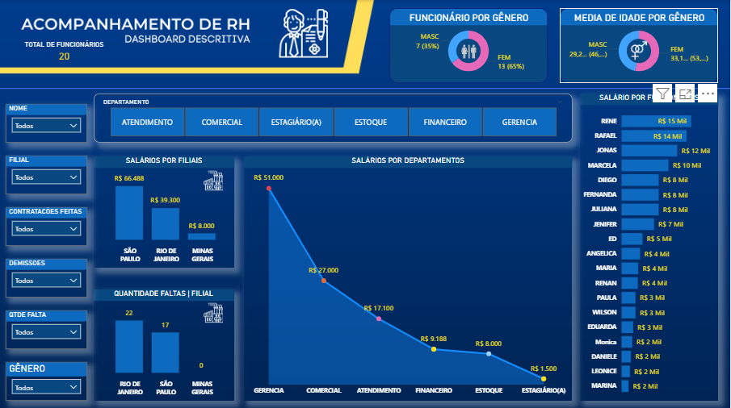

# Power BI Dashboard - Acompanhamento de RH

## Descrição
Este projeto consiste em um dashboard descritivo desenvolvido no Power BI para o acompanhamento de recursos humanos da empresa. O dashboard apresenta indicadores-chave de desempenho (KPIs), gráficos e tabelas que ajudam na visualização de informações sobre funcionários, gênero, salários por departamento e faltas por filial.

## Funcionalidades
- **Total de Funcionários**: Exibe o total de funcionários (20 no momento).
- **Funcionários por Gênero**: Gráfico de pizza com a distribuição de funcionários por gênero (MASC 73% e FEM 27%).
- **Média de Idade por Gênero**: Indicadores de média de idade por gênero (MASC 25.2 anos e FEM 31.1 anos).
- **Salários por Departamento**: Gráfico de linha com a evolução dos salários por departamento ao longo do tempo.
- **Salário por Funcionário**: Tabela detalhando o salário individual de cada funcionário.
- **Faltas por Filial**: Gráfico de barras com a quantidade de faltas por filial (São Paulo, Rio de Janeiro, Minas Gerais).
- **Filtros Interativos**: Permite filtrar por departamento, gênero, filial e outros critérios.

## Estrutura do Projeto
- **Dashboard Principal**: Inclui filtros interativos por departamento, gênero e filial.
- **Gráficos e Tabelas**: Visualizações dinâmicas para análise detalhada.
- **Indicadores**: KPIs como total de funcionários, média de idade e salários.

## 📷 Demonstração

> O dashboard é totalmente interativo, permitindo análises rápidas e comparativos entre períodos.
## Como Usar
1. Abra o arquivo `.pbix` no Power BI Desktop.
2. Conecte-se aos dados fontes (se necessário, atualize as conexões de dados).
3. Utilize os filtros no topo do dashboard para personalizar a visualização.
4. Explore os gráficos e tabelas para análise detalhada.

## Requisitos
- Power BI Desktop (versão mais recente recomendada).
- Acesso aos dados fontes (ex.: Excel, SQL Server, etc., dependendo da origem).

## Contribuições
Contribuições são bem-vindas! Por favor, envie um pull request ou abra uma issue para sugestões e melhorias.

## 👨‍💻 Autor

**Thiago Vinícius**  
📧 [thiagovfb.developer@gmail.com](mailto:thiagovfb.developer@gmail.com)  
📱 +55 (81) 9 8366-9631  

---

## 📜 Licença

Este projeto é de uso demonstrativo.  
Sinta-se à vontade para utilizá-lo como inspiração em seus próprios dashboards.
